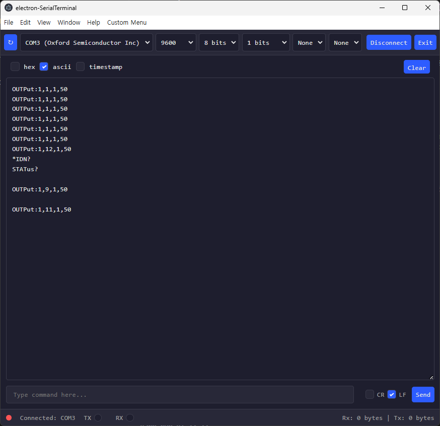

# electron serial term19




일렉트론에서 serialport를 IPC를 사용하지 않고, renderer.js에서 require()하여 사용한 예제입니다.

```
main.js
    const store = require('./store');
    nodeIntegration: true,  // defautlt=false
    contextIsolation: false,// default=true
```

"electron-store": "^8.2.0"를 사용한 이유: commonjs require()방식을 사용하기위해
- renderer.js에서 electron-store를 require()안됨, preload.js에도 안됨.(contextIsolation: false)

